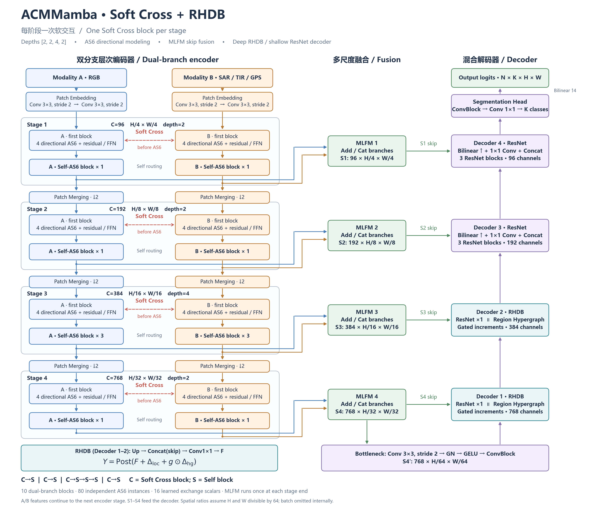

# ACMMamba：Soft Cross + MLFM + RHDB 整体架构

本图按 `configs/train_korea_no_cloud_baseline_rhdb.yaml` 中的结构配置绘制，
输入模态及类别数采用通用标注。该具体配置为 RGB3 + SAR1、5 类输出。

[可编辑 SVG](figures/acmmamba_soft_cross_rhdb_architecture.svg)

## 结构说明

- 编码器四阶段通道数为 96、192、384、768，深度为 2、2、4、2。
- 每阶段首个完整 block 执行 Soft Cross，其余 block 执行 Self：
  `C→S | C→S | C→S→S→S | C→S`。
- Soft Cross 在 AS6 处理之前混合反向行、反向列路径；正向路径保留本模态信息。
- 每个完整双分支 block 含 8 个独立 AS6，共 80 个。软交换系数共 16 个。
- 各阶段末尾执行一次 MLFM；A/B 特征继续编码，融合输出 S1–S4 用作解码器跳跃连接。
- S4 另外经过 stride-2 bottleneck 生成 S4′，输入第一个解码阶段。
- 按代码执行顺序，Decoder 1、2 使用 RHDB，分别对应 H/32、H/16，通道数为 768、384。
- Decoder 3、4 使用原始 ResNet UpBlock，各含 3 个残差块，分别对应 H/8、H/4。
- RHDB 的局部分支含 1 个残差块，与区域超图分支并行处理相同的融合特征 F。
- RHDB 输出为 `Post(F + delta_local + g * delta_hg)`；g 为逐位置的输入相关 sigmoid 门控，仅加权超图增量。
- 分割头为 ConvBlock → 1×1 分类卷积 → 双线性插值至原始输入尺寸，输出 logits。

图中 Decoder 编号按代码由深到浅排序，避免与按编码尺度编号的 D4/D3 混淆。
空间比例假设输入 H、W 可被 64 整除；实际代码按 skip 和输入张量尺寸插值。

## 论文图注草稿

**中文：** ACMMamba 总体架构。双分支编码器在各阶段首先进行 Soft Cross 交互，
随后通过 Self blocks 细化交互后的特征，并利用 AS6 完成方向序列建模。
各阶段末的 MLFM 将双模态特征融合为多尺度跳跃特征。
混合解码器在两个深层阶段采用 RHDB，通过空间门控组合局部残差增量与区域超图增量；
两个浅层阶段采用 ResNet 残差模块，逐级恢复分割结果。

**English:** Overview of ACMMamba. At each stage, the dual-branch encoder performs
Soft Cross interaction followed by self-routed feature refinement using AS6 blocks.
Stage-end MLFM modules generate multi-scale fused skip features. The hybrid decoder
uses RHDB at its two deepest stages to combine local residual and region-hypergraph
increments through spatial gating, followed by ResNet blocks at the two shallower
stages to progressively recover the segmentation output.

重绘：`python tools/draw_rhdb_model_architecture.py`。
图件已进行源码、配置核对与渲染检查；绘图不执行模型训练，也不修改模型配置。
